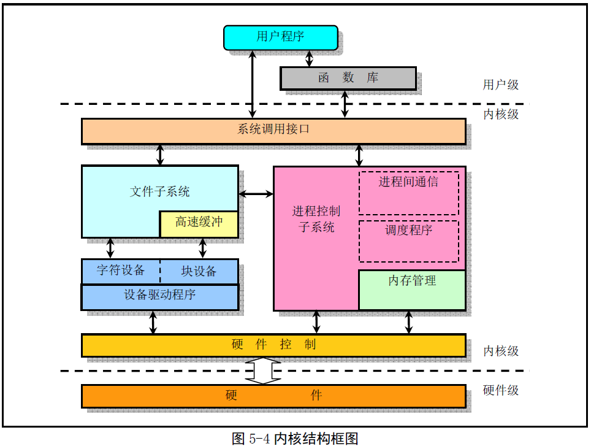
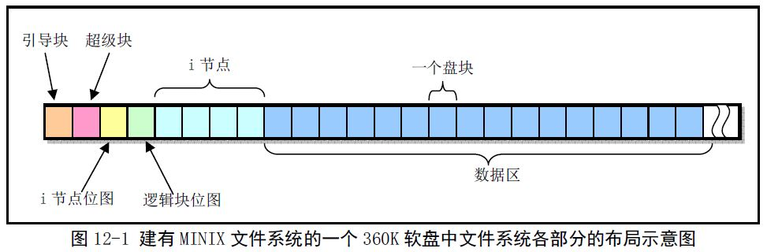
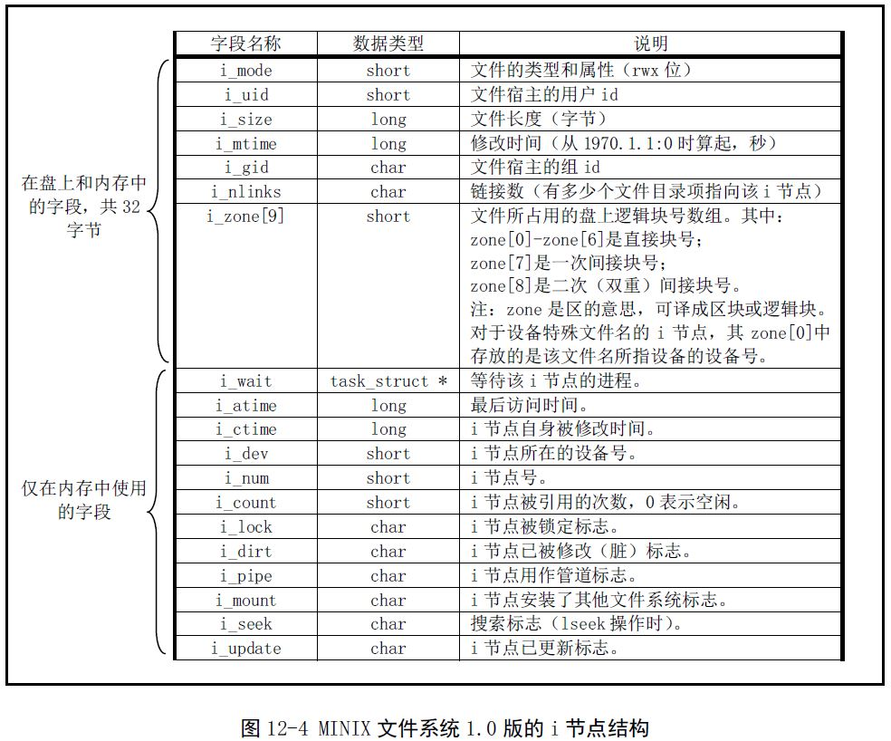
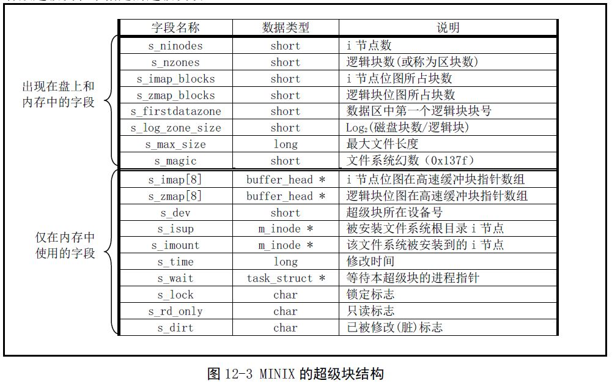

以下都是自己瞎理解，并不一定对，但会慢慢完善。


我们可以想象下，linux文件系统，是吧我们想利用的资源，以虚拟一种树状目录结构管理。最初我们主要想把，硬盘上的内容以树状的结构管理起来。
但是发现，其实好多硬件都可以放到这个树中。例如：字符设备串口等。
这要我们能清楚的管理硬件。简单既是美。这也是linux可能玩不了复杂的，只能简单的想到一切皆文件的理念吧。

我们先不考虑虚拟文件系统，其实虚拟文件系统只是在我们这个真实的文件系统上再虚拟一层。因为可能由于兴趣原因，我们不想在每个硬盘上都放一种真实文件，有的像放fat，有的想放ext3，有的想法minix。呵呵，有点开玩笑。由于一个电脑上有多个文件系统。我们又不想让用户用写个应用还得open_ext3 read_ext3z这个样子。所以我们又封装了以下open->open_ext3,用户还是只要调用open就可以了，所以有了虚拟文件系统。
不过我们现在不想管，我们就一个文件系统minix。因为我怕乱了，额。



还是以上经典图：

下面minix文件系统在硬盘上的结构


**超级块**用于存放盘设备上文件系统结构信息

**i节点**存放着文件系统中文件或目录名的索引节点，每个文件或目录都有一个i节点。

**逻辑块位图**用于描述盘上每个数据盘款的使用情况。

**i节点位图**用于说明i节点是否被使用。


>int bmap(struct m_inode * inode,int block)

bmap实现了以上i节点和超级块的关联。

namei也是利用bmap解析文件系统中树目录结构

下面你会发现namei处在什么位置。

linux下文件系统和块设备包含的一些概念：

1. 主设备号：blk_dev[NR_BLK_DEV]
2. 从设备号：

通过blk_dev[MAJOR_NR].request_fn = DEVICE_REQUEST;
注册void do_hd_request(void)功能


看看linux 0.11是怎么通过read调用到硬盘上的。

调用流程
```
应用
| read->中断
V
read_write.c----------------文件系统上层接口-----------------
| sys_read
V
fs/block_dev.c--------------文件系统下层/块设备接口-----------
| block_read
V
fs/buffer.c 
| breada
V
blk_drv/ll_rw_blk.c---------块设备/设备驱动上层接口----------
| ll_rw_block->make_request->add_request->request_fn
| ->do_hd_request
V
kernel/blk_drv/hd.c---------设备驱动底层接口----------------
| do_hd_request
V
```

每个任务都有一个自己的task_struct *current;
current中包含了任务打开的文件fd。
struct file * filp[NR_OPEN];

open.c
open
|
V
open_namei
次函数是操作文件系统树目录的重要体现接口。

open_namei返回的是struct m_inode
```
struct m_inode {
	unsigned short i_mode;
	unsigned short i_uid;
	unsigned long i_size;
	unsigned long i_mtime;
	unsigned char i_gid;
	unsigned char i_nlinks;
	unsigned short i_zone[9];
/* these are in memory also */
	struct task_struct * i_wait;
	unsigned long i_atime;
	unsigned long i_ctime;
	unsigned short i_dev;
	unsigned short i_num;
	unsigned short i_count;
	unsigned char i_lock;
	unsigned char i_dirt;
	unsigned char i_pipe;
	unsigned char i_mount;
	unsigned char i_seek;
	unsigned char i_update;
};
```


```
struct super_block {
	unsigned short s_ninodes;
	unsigned short s_nzones;
	unsigned short s_imap_blocks;
	unsigned short s_zmap_blocks;
	unsigned short s_firstdatazone;
	unsigned short s_log_zone_size;
	unsigned long s_max_size;
	unsigned short s_magic;
/* These are only in memory */
	struct buffer_head * s_imap[8];
	struct buffer_head * s_zmap[8];
	unsigned short s_dev;
	struct m_inode * s_isup;
	struct m_inode * s_imount;
	unsigned long s_time;
	struct task_struct * s_wait;
	unsigned char s_lock;
	unsigned char s_rd_only;
	unsigned char s_dirt;
};
```



