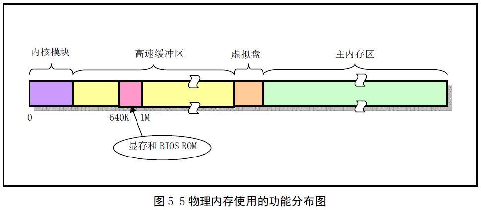

计算机基本硬件：I/O接口 硬盘 内存 CPU 时钟 看门狗

​			       内存(有可能需要考虑 MMU和cache等)

​				CPU(中断)


操作系统分为 两部分 ：

1. 资源部分：以文件系统的方式呈现
2. 调度部分：以多进程的方式呈现

操作系统说复杂也确实很复杂，但是如果从简单点的角度去看他，其实也没那么玄乎，我们先不要考虑mmu，毕竟没有mmu的情况也有好多操作系统。
没有mmu就是直接内存。

开始不要有内存顾虑，然后就是中断，我们自己写的库是直接调用的，
而内核也算是一个库吧，只是这个库自己也在运行，并且调用方式是通过中断。

我们的大体方向为两面夹击型，其实有人问嵌入式linux怎么学，应该先从什么开始学，我理解为没有什么固定应该从那里学，从你最熟悉的部分开始学，这样好理解，你直接只会裸板开发，那你就能简单熟悉下linux命令，开始设备驱动。如果之前是应用开发，那就从你熟悉角度去理解。不管从哪个方向走，都会是条条大路通罗马。

像如果想熟悉linux kernel，我们还是最好从简单的开始，两面夹击型。
我们最好有裸板经验，然后是设备驱动经验。然后再开始内核框架。我想这样最好了。

操作系统的功能：
	1.管理硬件，这就是为什么linux要有设备驱动的概念。
	2.程序调度，能让这个机器cpu等发挥更多的性能。

以上也是比bootloader多出的重要部分。当然为了多进程的调度更加方便和内存利用最大化，还应多出了重要器件mmu。并且，为了让进程能用到硬件，还通过中断提供了一系列系统调用。其实对应用来说内核就是一个稍微特殊点的库而已。

我们先还管不了应用，我们先把内核自己运行溜了，并且能管理起来各个硬件再说，这其实就是实现了一个简单的bootloader一样的东西。
然后我们想更容易用这些硬件，我们提出了文件系统等一些概念。

大家看看内核这个程序的大致结构：
这个图果然很经典。


调度部分是本内核程序控制别的程序运行功能。额，暂可把它当作内核大大的一个小功能即可。我的的思路是先把内核自己想要运转溜了，所以，就不要想先玩转别人。

貌似，这有点像我们先实现一个bootload。bootload的功能就是加载内核。而我们这个功能只是多一点而已。

我应该简单总结下bootload的编写流程，然后如果在bootload基础上添加：文件系统、进程调度等功能。实现操作系统的样子。

操作系统的发展估计也是这个样子，逐步添加小功能呗。

bootload编写流程：
1. 熟悉板子引导流程，编写最开始的引导部分代码，最好是汇编。
2. 初始化一些必要的硬件可以用c。有：时钟、ram、nand、串口。
3. 编写shell。添加一些必要的命令。
  基本就以上这些。算是最基本的bootloader。

我们可以在以上bootloader的基础上添加例如：文件系统，内存管理、调度等功能就成为了操作系统。

有了思路就好办了，

由于操作系统比较庞大，而且要求每个模块的逻辑协作比较复杂。所以我想在实现操作的时候可以先订个小目标。例如：我先不实现调度部分，我先能实现资源部分。能够通过文件系统访问资源。

第一个小目标：在终端实现执行ls
	当然，由于硬件支持用户态和内核态能，先都放下，我们只在内核态实现。
	其实，如果添加用户态和内核态功能，程序在调用的时候只是利用了中断方式，但为了简单和入门。我们不走此流程。现在只是先入门并能够开始。
	首先：我把硬件平台简单描述下，毕竟我们是要在一个特定的硬件实现系统。当然我们不深入讨论体系结构或是组成原理。不然我们有可能陷入另一个学科，而不是此次的实践目的了。
	一个程序想要通过CPU实现执行，必须是CPU可随机访问的。我所说的内存当然满足此要求。但是内存是掉电丢失的，所以我们要把程序先放到可以掉电不丢失的硬盘上。当然不是硬盘软盘、光盘、u盘随便你喜欢什么都可以，只要能保存程序就可以了。有了以上认识，我们就可以总结出，想要运行我们的系统。必须要有cpu、内存、硬盘。
	我们以s3c2440为例子，s3c2440的cpu为arm920，内存为外置sdram， 硬盘为nand
	当然用到的硬件肯定不止这些，但是我们可以用到哪些了解哪些就可以了。


以上为最基本硬件信息， 但是我们还需要有个输入输出、不然怎么操作我们的系统 ，呵呵。

说到输入输出，又想提一下串口和文件系统， 因为我们想通过串口操作我们的系统，但是我们又不想太low，直接操作硬件，不然我们要操作系统干什么，而linux是一切皆文件的思想，文件的体现方式为文件系统实现的。所以还是有必要提一下文件系统。

我们先以read/write来入手，层层剥开文件系统的面纱。


因为想要

write 的实现原理
以下为write定义

>lib目录下 - 用户系统接口

write.c
```c
_syscall3(int,write,int,fd,const char *,buf,off_t,count)
```

unistd.h
```c
#define _syscall3(type,name,atype,a,btype,b,ctype,c) \
type name(atype a,btype b,ctype c) \
{ \
long __res; \
__asm__ volatile ("int $0x80" \
	: "=a" (__res) \
	: "0" (__NR_##name),"b" ((long)(a)),"c" ((long)(b)),"d" ((long)(c))); \
if (__res>=0) \
	return (type) __res; \
errno=-__res; \
return -1; \
}
```
从以上可以看出wirte是通过80中断到内核的，内核通过以下处理
>kernel目录下 - 内核中断处理

set_system_gate(0x80,&system_call);
和
system_call.s和sys_call_table[]

真正执行到：read_write.c
>fs目录下 - 真正调用到内核的函数 

int sys_write(unsigned int fd,char * buf,int count)

可以看出，期间以上参数可以通过寄存器传递。

也完全像内核注释上所说，用户通过系统调用到了文件系统。
​    

在用户态write的函数，就不用说了大家肯定已经很熟悉了，
有必要说的就剩下内核终端处理部分，
和文件系统实现部分了。

想要实现文件系统，根据上面的图，大家发现我们要先实现块设备。
呵呵。我们又要先实现字符设备和块设备驱动程序。

字符设备先放放，我们先看看块设备。

块设备底下为nand flash，我们这个块设备要把nand flash抽象后给文件系统提供接口。


