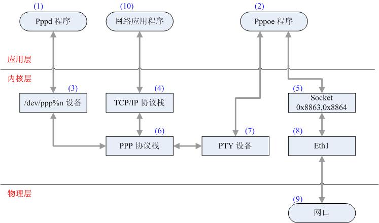

1.   介绍

通过对Linux源代码的分析,了解PPP设备在linux内的工作原理.顺便了解一下PPPoE如何利用PPP设备来完成上网的工作的.下面是代码研究的基础版本：

       
Software  	version
Linux内核	2.6.15
PPPd	ppp-2.4.3
PPPoE	rp-pppoe-3.8

2.   PPP相关模块及结构

 

注：每个模块左上角或右上角蓝色字体的数字是用来方便区别每个模块。

每个层次及工作在该层次的程序（模块）分析如下：

2.1 应用层模块概述

工作在该层的模块编号：（1）Pppd、（2）Pppoe、（10）网络应用程序

2.1.1   Pppd

使用源代码ppp-2.4.3编译生成，该程序用来完成PPP过程（lcp/pap/chap/ipcp等）的应用程序.它和Pppoe两个用户态应用程序配合起来,可以完成PppOe的拨号上网的链路协商及维护.

熟悉Ppp相关协议的知道,Ppp链路协商过程有LCP/PAP/CHAP/PAP等很多协议.这些包会经由协议栈分类,提交到字符设备/dev/ppp0的队列中.而Pppd这个应用程序,就是从ppp0中将这些包读取出来,然后递交到各协议的子过程中去处理,从而在应用态完成这些协议的处理过程.

这里需要提一点,要想深入的理解Pppd应用程序的工作方法,必须要了解字符设备ppp0是如何工作的.

2.1.2   Pppoe

首先,pppoe完成了PPPoE Discovery过程,这个过程很简单,只有PADI/PADO, PADR/PADS四个包.主要目的是相互告知MAC地址.

另外,这个程序负责接收和发送Pppoe链路的所有数据包,包括ppp协议过程的数据包,也包括正常网络应用通过网络接口ppp发送的TCP/IP数据包.在此需要了解类型为0x8863/0x8864的Socket如何工作,另外需要了解数据包如何通过PTY设备在Pppoe和PPP协议栈之间传递的.在内核模块概述中会给予描述.

所以,我们可以将pppoe应用程序作为拨号链接进入主机的入口,所有的数据包都经由它进入主机.

2.1.3   网络应用程序

这里指一般网络应用，比如上网、下载等。主要作用是描述普通数据包的行走路径.

2.2 内核层模块概述

工作在该层的模块编号：（3）/dev/ppp%n、（4）TCP/IP协议栈、（5）Socket、（6）PPP协议栈、（7）PTY设备、（8）ETH1

2.2.1   /dev/ppp%n

该设备需要打开内核支持,可以make menuconfig选择相应的子项,另外需要在/dev目录下创建主设备号为108从设备号为0的字符设备才可以在用户态使用.

创建了ppp设备后，ppp过程的数据包经过协议栈的分类,会被送到该接口的队列内.用户态应用程序(如pppd)从该接口内读取ppp过程的数据包，然后送交相应的协议栈处理.对于响应的数据包,同样可以写入到该设备中,设备内会将数据包送交协议栈然后转发出去.

2.2.2   TCP/IP协议栈

普通Linux TCP/IP协议栈.

2.2.3   Socket

PppOe Session和Discovery数据包对应的以太网类型分别为0x8863/0x8864,因为这两种类型的数据包是由Pppoe应用程序通过Socket来收发的,所以内核中需要定义这两种类型的Socket.这两个Socket内核处理非常简单,只做了最基本的检查便由Pppoe收取上来.

2.2.4   PPP协议栈

主要负责PPP层数据的封装、压缩与解压缩.另外,它还对普通数据包和Ppp过程的数据包进行了分流,将普通数据包提交到TCP/IP协议栈,而将Ppp过程的数据包放到/dev/ppp设备队列中,等待Pppd去收取并处理.

2.2.5   PTY设备

串行设备，PPP内核协议栈与pppoe应用程序的中转站.因为Ppp协议早多运行在串行链路上,所以在Linux内核中PPP协议栈与串行设备结合紧密.

2.2.6   Eth1

这里是指连接以太网的出口,用来表示数据包路径而引入.

2.3 物理层模块概述

工作在该层的模块编号：（9）以太网驱动

3.   PPPoE拨号建立的过程

从拨号链接开始到用户可以上网主要分三个过程：

Ø PPPoE Discovery过程

Ø PPP过程

Ø 设置上网主机

3.1 PPPoE Discovery 过程
