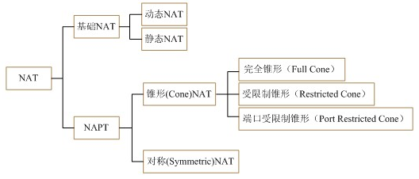

作者：陈军链接：https://www.zhihu.com/question/38729355/answer/77877260

来源：知乎著作权归作者所有。商业转载请联系作者获得授权，非商业转载请注明出处。      

​	NAT分为两大类，基本的NAT和NAPT（Network Address/Port Translator）。 
基本的NAT，它仅将内网主机的私有IP地址转换成公网IP地址，但并不将TCP/UDP端口信息进行转换，有动态与静态之区分。由于现在大部分都属于另一种类型，即NAPT，故这里不详细讨论基础NAT。 另外一种NAT叫做NAPT（Network Address/Port Translator），从名称上我们也可以看得出，NAPT不但会改变经过这个NAT设备的IP数据报的IP地址，还会改变IP数据报的TCP/UDP端口。

​      NAPT又分为锥型（Cone）和对称型（Symmetric），它们的区别在于，在NAT已分配端口号给Client A的情况下，如果Client A继续用1235端口与另一外网服务器通讯，锥型NAT还会继续用原来62000端口，即所分配的端口号不变。而对于对等型NAT，NAT将会分配另一端口号（如62001）给Client A的1235端口。也就是说，同一内网主机同一端口号，对于锥型NAT，无论与哪一外网主机通讯，都不改变所分配的端口号；而对于对等型NAT，同一内网主机同一端口号，每一次与不同的外网主机通讯，就重新分配另一个端口号。 

​    目前比较常用的NAT类型是完全锥型NAT。

1. 首先目前绝大多数的路由器都是非对称型NAT(Cone NAT)，所以P2P技术才能正常使用。 对称/非对称的区别主要在于：网关设备在实现NAT时，对于内网某主机的若干个UDP连接请求，网关设备对应地在外网上所建立的UDP端口数量。对称NAT是一个请求对应一个端口，非对称NAT是多个请求对应一个端口(象锥形，所以叫Cone NAT)。
2. 对称型NAT(Symmetric NAT)是无法实现P2P技术。 

​	对于两方都是对称nat的情况，至少从可以了解的途径上（比如google，相关论坛）都没找到解决方案，我们自己也进行过测试，不行。

​	但是对于一端是对称nat，一端是端口限制性Cone nat的情况是可以打洞成功的，特别是我们实验的对称nat的端口变化还是有规律的（加1），我们使用端口猜测的方法进行打洞成功率还是非常高的。对于端口变化无规律的对称nat，这个猜测还是靠算法的设计，

可以看看**A New Method for Symmetric NAT Traversal **in UDP and TCP 

（http://www.goto.info.waseda.ac.jp/~wei/file/wei-apan-v10.pdf）
