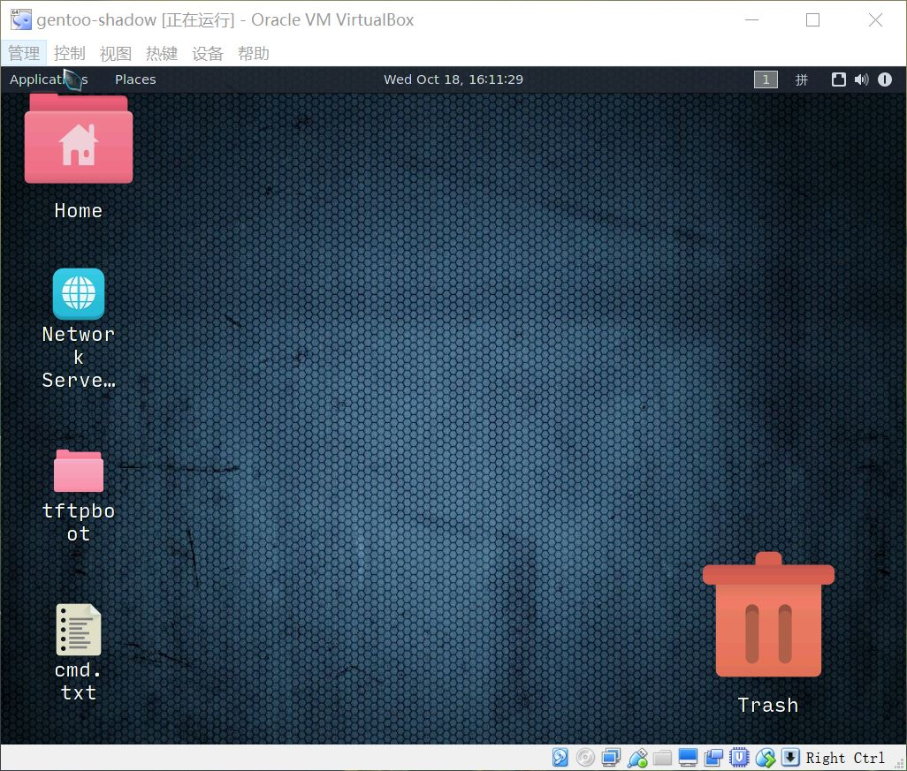

> 显卡->驱动->xorg->gnome->gui

查看显卡：lspci  | grep -i VGA

查看驱动：lspci  -vvv 
​          
>/dev/nvidia0, /dev/nvidiactl
>
>是NV 官方驱动引入的两个设备文件

驱动安装：x11-drivers/xf86-video-nouveau
    x11-drivers/xf86-video-virtualbox

xorg支持： VIDEO_CARDS="nouveau virtualbox"
	emerge -pv xorg-drivers

>现在的xorg也不需要/etc/X11/xorg.conf  
>注意把/etc/X11/xorg.conf.d/下默认的配置删除 例如:01-nv.conf

```
当然你就想手动指定驱动等信息添加xorg.conf
也是没有问题的。例如：
Section "Device"                                     
        Identifier      "Configured Video Device"     
        Driver          "fbdev"                  
EndSection 
以上显卡设备为lcd 驱动设备为：/dev/fb0
驱动类型为：framebuffer xf86-video-fbdev
大家可以看看韦东山介绍 mini2440就是用此驱动。
framebuffer表示显卡不具备任何计算能力，完全利用cpu计算。
```

startx：为以上xorg gnome协同作战的脚本
```
不用startx ，手动
xorg的xinit和
gnome的gnome-session
都是可以的。
xinit 找的是/dev/nvidia0, /dev/nvidiactl
gnome-session 找的是export DISPLAY=:2
```


配置文件：.xinitrc
```
export GTK_IM_MODULE=ibus
export XMODIFIERS=@im=ibus
export QT_IM_MODULE=ibus
export XDG_MENU_PREFIX=gnome-
xrandr --setprovideroutputsource modesetting NVIDIA-0
xrandr --auto
exec gnome-session
dbus-launch nm-applet &
```


```
01:00.0 VGA compatible controller: NVIDIA Corporation G84GLM [Quadro FX 570M] (rev a1) (prog-if 00 [VGA controller])
        Subsystem: Lenovo ThinkPad T61p
        Physical Slot: 1
        Control: I/O+ Mem+ BusMaster+ SpecCycle- MemWINV- VGASnoop- ParErr- Stepping- SERR- FastB2B- DisINTx-
        Status: Cap+ 66MHz- UDF- FastB2B- ParErr- DEVSEL=fast >TAbort- <TAbort- <MAbort- >SERR- <PERR- INTx-
        Latency: 0
        Interrupt: pin A routed to IRQ 16
        Region 0: Memory at d6000000 (32-bit, non-prefetchable) [size=16M]
        Region 1: Memory at e0000000 (64-bit, prefetchable) [size=256M]
        Region 3: Memory at d4000000 (64-bit, non-prefetchable) [size=32M]
        Region 5: I/O ports at 2000 [size=128]
        [virtual] Expansion ROM at 000c0000 [disabled] [size=128K]
        Capabilities: [60] Power Management version 2
                Flags: PMEClk- DSI- D1- D2- AuxCurrent=0mA PME(D0-,D1-,D2-,D3hot-,D3cold-)
                Status: D0 NoSoftRst- PME-Enable- DSel=0 DScale=0 PME-
        Capabilities: [68] MSI: Enable- Count=1/1 Maskable- 64bit+
                Address: 0000000000000000  Data: 0000
        Capabilities: [78] Express (v1) Endpoint, MSI 00
                DevCap: MaxPayload 128 bytes, PhantFunc 0, Latency L0s <512ns, L1 <4us
                        ExtTag+ AttnBtn- AttnInd- PwrInd- RBE+ FLReset- SlotPowerLimit 75.000W
                DevCtl: Report errors: Correctable- Non-Fatal- Fatal- Unsupported-
                        RlxdOrd+ ExtTag+ PhantFunc- AuxPwr- NoSnoop+
                        MaxPayload 128 bytes, MaxReadReq 512 bytes
                DevSta: CorrErr- UncorrErr- FatalErr- UnsuppReq- AuxPwr- TransPend-
                LnkCap: Port #0, Speed 2.5GT/s, Width x16, ASPM L0s L1, Exit Latency L0s <512ns, L1 <4us
                        ClockPM- Surprise- LLActRep- BwNot- ASPMOptComp-
                LnkCtl: ASPM L0s Enabled; RCB 128 bytes Disabled- CommClk+
                        ExtSynch- ClockPM- AutWidDis- BWInt- AutBWInt-
                LnkSta: Speed 2.5GT/s, Width x16, TrErr- Train- SlotClk+ DLActive- BWMgmt- ABWMgmt-
        Capabilities: [100 v1] Virtual Channel
                Caps:   LPEVC=0 RefClk=100ns PATEntryBits=1
                Arb:    Fixed- WRR32- WRR64- WRR128-
                Ctrl:   ArbSelect=Fixed
                Status: InProgress-
                VC0:    Caps:   PATOffset=00 MaxTimeSlots=1 RejSnoopTrans-
                        Arb:    Fixed- WRR32- WRR64- WRR128- TWRR128- WRR256-
                        Ctrl:   Enable+ ID=0 ArbSelect=Fixed TC/VC=01
                        Status: NegoPending- InProgress-
        Capabilities: [128 v1] Power Budgeting <?>
        Capabilities: [600 v1] Vendor Specific Information: ID=0001 Rev=1 Len=024 <?>
        Kernel driver in use: nvidia
        Kernel modules: nouveau, nvidia_drm, nvidia
```


注:

之前virtualbox的驱动总是不能成功, **改为vesa折中解决**.	  	

具体为删除virtualbox驱动, emerge -C virtualbox-guest-additions  		

如果启动还是加载vboxvideo等驱动, 

那就直接删除重新安装

``` shell
 rm /lib/modules/* -rf  		
 cd /usr/src/linux &&  make modules_install
 emerge -av @module-rebuild
```

并且添加/etc/X11/xorg.conf.d/10-monitor.conf

``` shell
Section "Monitor"
    Identifier    "Monitor0"
EndSection

Section "Device"
    Identifier    "Device0"
    Driver        "vesa" #Choose the driver used for this monitor
EndSection

Section "Screen"
    Identifier    "Screen0"  #Collapse Monitor and Device section to Screen section
    Device        "Device0"
    Monitor       "Monitor0"
    DefaultDepth  16 #Choose the depth (16||24)
    SubSection "Display"
        Depth     16
        Modes     "1024x768_75.00" #Choose the resolution
    EndSubSection
EndSection
```

这样省了virtualbox 驱动版本等匹配问题.当然性能也下降了.

当然我自己还挖了个坑 那就是还要删除

 /etc/local.d/nvidia.start
不然重启又修改了




当然安装vboxvideo 会提高性能 只要在/etc/portage/make.conf添加

> VIDEO_CARDS="virtualbox vesa fbdev"

并更新下系统就可以

> emerge -avtuDN world

如果/etc/X11/xorg.conf 和/etc/X11/xorg.conf.d 不会配置 建议直接删除就可以了

同时可参考:

https://wiki.gentoo.org/wiki/VirtualBox

