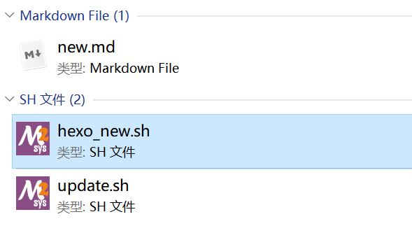

之前用wordpress做blog, 为什么换为hexo呢?

第一 

​	wordpress的文章都保存在服务器的数据库, 维护不是很直观.

​	而hexo是自己编写markdown文章,本地一份,而blog只是本地的映射.

​	这样文章更好维护和查看.因为做笔记更重要的是自己也能查看.

第二

​	hexo用的github pages服务, 服务器器是git, 自己剩下服务器不说,

​	还能用到git的强大版本控制功能,真是一举多得.


如果大家发下同步命令复杂,完全可以做个成脚本就像我这这个样,点击脚本就可

把文章同步了. 真的很方便, 以下为同步步骤.




1. 执行hexo_new.sh 生成new.md
2. 编辑new.md为你要写的blog内容
3. 把new.md放到你要的分类目录
4. 执行update.sh同步blog.
5. 呵呵,完成了

hexo_new.md

``` shell
#!/bin/bash
set -x
export PATH="/usr/local/bin:/usr/bin:/bin:/opt/bin:/c/Windows/System32:/c/Windows:/c/Windows/System32/Wbem:/c/Windows/System32/WindowsPowerShell/v1.0/:/usr/bin/site_perl:/usr/bin/vendor_perl:/usr/bin/core_perl:/opt/toolchain/gcc-linaro-6.3.1-2017.05-x86_64_arm-linux-gnueabihf/bin:/opt/FriendlyARM/toolschain/4.4.3/bin:/c/Users/jimmy/AppData/Roaming/npm:/c/Program Files/nodejs"
cd /e/hexo/
hexo new "new"
```

update.sh

```shell
#!/bin/bash
set -x
export PATH="/usr/local/bin:/usr/bin:/bin:/opt/bin:/c/Windows/System32:/c/Windows:/c/Windows/System32/Wbem:/c/Windows/System32/WindowsPowerShell/v1.0/:/usr/bin/site_perl:/usr/bin/vendor_perl:/usr/bin/core_perl:/opt/toolchain/gcc-linaro-6.3.1-2017.05-x86_64_arm-linux-gnueabihf/bin:/opt/FriendlyARM/toolschain/4.4.3/bin:/c/Users/jimmy/AppData/Roaming/npm:/c/Program Files/nodejs"
cd /e/demonelf.github.io/
git pull
cd /e/hexo/
hexo g
rsync -Pv --size-only /e/hexo/public/* /e/demonelf.github.io/ -ar 
rsync -Pv --size-only /e/hexo/source/_posts/* /e/demonelf.github.io/ -ar
cd /e/demonelf.github.io/
git add -A
git commit -m "1.自动更新"
git push
```

